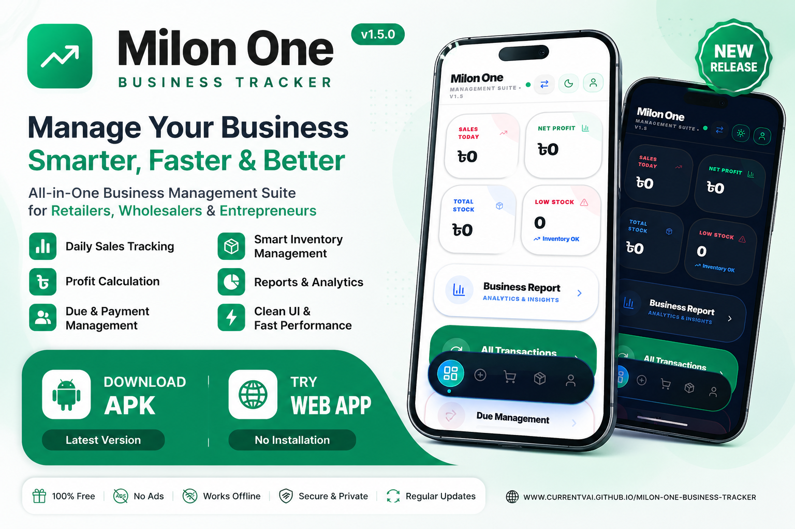

<p align="center">
  
</p>

<h1 align="center">🚀 Milon One Business Tracker</h1>
<h3 align="center">Smart POS • Inventory • Accounting • Business Intelligence</h3>

<p align="center">
  
  
  
  
</p>

---

## 📌 About the Project

**Milon One Business Tracker** is a next-generation **business management ecosystem** built for SMEs to handle:

- **Sales:** Comprehensive POS System
- **Inventory:** Real-time stock management
- **Finance:** Complete accounting & reports
- **Analytics:** Data-driven business intelligence

It is designed for **speed, scalability, and real-time control**.

---

## ⚡ Core Features

### 💰 Smart POS System
- Lightning fast billing & auto invoice generation
- Flexible discount & tax management system

### 📦 Inventory Engine
- Real-time stock updates with low stock alerts
- Full support for product barcodes

### 📊 Business Intelligence
- Interactive sales analytics dashboard
- Automated profit/loss and daily reports

### ☁️ Cloud Sync
- Secure Firebase authentication
- Scalable Supabase database integration
- Real-time synchronization across all devices

---

## 🌐 Live Access

<p align="center">
  <a href="https://currentvai.github.io/Milon-One-Business-Tracker/app/">
    
  </a>
</p>

- ✔ **No installation required** – Access directly via browser
- ✔ **Cross-platform** – Works perfectly on mobile & desktop
- ✔ **Instant Sync** – Real-time data management

---

## 🛠️ Tech Stack

| Layer | Technology |
|------|------------|
| **Frontend** | React.js + Vite |
| **Mobile** | Android Studio (Kotlin) |
| **Backend** | Firebase + Supabase |
| **UI/UX** | Minimal Luxury Design |
| **Auth** | Firebase Authentication |

---

## 📥 Installation

### 📱 Android App
1. Download the latest APK from [Releases](https://github.com/currentvai/Milon-One-Business-Tracker/releases)
2. Enable **"Unknown Sources"** in your device settings
3. Install and launch the app

<p align="center">
  <a href="https://github.com/currentvai/Milon-One-Business-Tracker/releases">
    
  </a>
</p>

### 🌐 Web Dashboard
No setup needed. Simply open:
<p align="center">
  <a href="https://currentvai.github.io/Milon-One-Business-Tracker/app/" target="_blank">
    
  </a>
</p>

---

## 📂 Project Architecture
```bash
├── app/          # Android Application (Kotlin)
├── web/          # Web Dashboard (React + Vite)
├── auth/         # Shared Authentication Logic
└── assets/       # UI Components & Media Resources
```

---

<!-- ================= ROADMAP ================= -->
## 🗺️ Roadmap

### ✅ Completed
- 💳 POS System  
- 📦 Inventory Management  
- 🌐 Web Dashboard  

### 🚀 Upcoming Features
- 🤖 AI Sales Prediction  
- 🏢 Multi-branch System  
- 💰 Payment Gateway Integration  
- 📊 Advanced Reports & Analytics  

---
 
<!-- ================= SECURITY ================= -->
🛡️ Security Layer
Firebase Secure Auth
Role-based Access Control
Encrypted Database
Secure API Handling

---

<!-- ================= CONTRIBUTION ================= -->
🤝 Contribution Guide
Fork → Branch → Code → Pull Request

We welcome developers to improve the ecosystem.

---

<!-- ================= FAQ ================= -->
❓ FAQ

Q: Is it free?
✔ Yes, MIT Licensed

Q: Works offline?
✔ Partial offline support available

Q: Mobile supported?
✔ Yes, Android APK included

---

<!-- ================= STATS ================= -->
📊 Repository Stats
<p align="center">    </p>

<!-- ================= CONTACT ================= -->
📬 Contact & Support

Developer: currentvai
---

## 📬 Connect With Me

<p align="center">

<a href="https://github.com/currentvai">
  
</a>

<a href="https://t.me/currentvai">
  
</a>

<a href="https://facebook.com/cv.hasan.3">
  
</a>

</p>

---

## ⚡ Footer

<p align="center">
  <b>🚀 Milon One Business Tracker</b><br>
  Built with passion for SMEs • Scalable • Fast • Secure<br><br>
  <sub>© 2026 Current Vai. All Rights Reserved.</sub>
</p>
